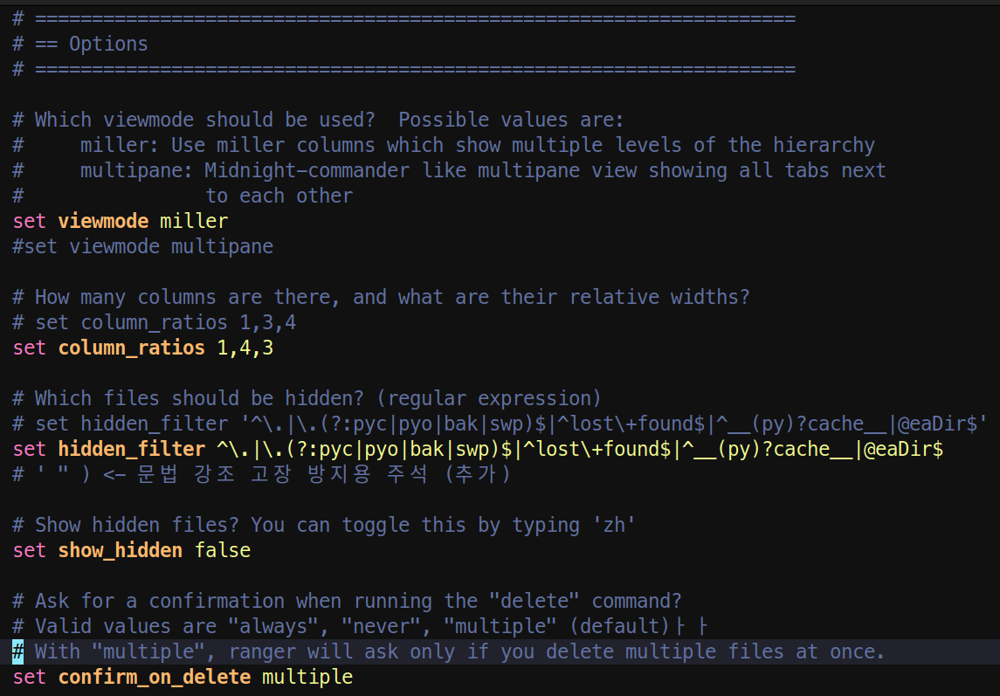

# tree sitter for ranger rc.conf

A custom Tree-sitter grammar designed to provide precise syntax highlighting for the ranger file manager's configuration files in modern text editors.




## 📖 Introduction & Motivation

[ranger](https://github.com/ranger/ranger) is a free, open-source console file manager with VI key bindings. It provides a minimalistic and beautiful curses interface with a unique view of the directory hierarchy. I literally cannot live without `ranger`—it is the absolute core of my daily terminal workflow!

However, while heavily customizing my `rc.conf`, I realized there was no dedicated [Tree-sitter](https://tree-sitter.github.io/tree-sitter/) grammar to provide precise syntax highlighting for modern text editors like [Helix](https://helix-editor.com/). I wanted my `set`, `map`, and custom shell-scripted arguments to be beautifully and accurately colored, rather than relying on generic fallback highlighters.

Thus, this project was born to build a simple, custom Tree-sitter parser tailored specifically for the `ranger` configuration file.

## 🤖 Built with "Vibe Coding" (Powered by Gemini)

I started this project not just to get syntax highlighting, but also as a hands-on opportunity to study how Tree-sitter works under the hood.

To do this, I adopted the **"Vibe Coding"** approach—steering the architecture and generating the logic entirely through natural language interactions with Google's **Gemini**. Instead of getting bogged down in boilerplate C code, I collaborated with Gemini to design the AST (Abstract Syntax Tree), refine the `grammar.js` rules, and troubleshoot complex Editor-Parser compatibility issues. It proved to be an incredibly easy, fast, and fun way to learn and build a Tree-sitter parser from scratch!

## Installation

Clone

```shell
git clone https://github.com/tohichoi/tree-sitter-rangerrc
cd tree-sitter-rangerrc
```

Build

```shell
npm init -y
npm install --save-dev tree-sitter-cli
npx tree-sitter generate
```

Create or modify ~/.config/helix/languages.toml

```toml
[[grammar]]
name = "rangerrc"
source = { git = "https://github.com/tohichoi/tree-sitter-rangerrc", rev = "main" } 
# source = { path = "/home/<User ID>/Workspace/tree-sitter-rangerrc" } 

[[language]]
name = "rangerrc"
scope = "source.rangerrc"
file-types = [
  { glob = "rc.conf" }
]
roots = []
grammar = "rangerrc"
```

Copy highlights.scm to runtime dir

```shell
mkdir -p ~/.config/helix/runtime/queries/rangerrc
cp highlights.scm ~/.config/helix/runtime/queries/rangerrc
```

Build helix grammar

```shell
hx --grammar fetch
hx --grammar build
```

Test

```shell
hx --health rangerrc
```

should be

```shell
Configured language servers: None
Configured debug adapter: None
Configured formatter: None
Tree-sitter parser: ✓
Highlight queries: ✓
Textobject queries: ✘
Indent queries: ✘
```

## 🛠️ Troubleshooting

During the integration of this grammar with Helix (specifically v25.07), I encountered several critical issues. Here is a summary of the problems and how to solve them:

### 1. Incompatible ABI Version Error

* **Symptom:** Running `hx --grammar build` or `hx --health` throws an error: `Incompatible language version 15. Expected minimum 13, maximum 14`.
* **Cause:** The latest Tree-sitter CLI generates C code using ABI version 15 by default, but the built-in Tree-sitter engine in Helix (as of v25.07) only supports up to ABI 14.
* **Solution:** Force the CLI to generate the parser with ABI 14.
```bash
npx tree-sitter generate --abi 14

```


### 2. Parser shows as `None` in `hx --health`

* **Symptom:** The grammar builds successfully, but running `hx --health rangerrc` shows `Tree-sitter parser: None`.
* **Cause:** Helix strictly matches the compiled `.so` file name with the internal identifiers. If the internal `name` in `grammar.js` or `tree-sitter.json` differs from the name defined in Helix's `languages.toml`, or if the C parser code was not regenerated after a name change, Helix will fail to load the binary.
* **Solution:** Ensure the identifier is unified across all files. In this project, the name is strictly set to **`rangerrc`**. Your `languages.toml` must match this exactly:
```toml
[[grammar]]
name = "rangerrc"

[[language]]
name = "rangerrc"
scope = "source.rangerrc"
grammar = "rangerrc"

```


*(Note: Always remember to run `npx tree-sitter generate` again if you change the name in `grammar.js`!)*

### 3. Ghost Files and Aggressive Helix Caching

* **Symptom:** Changes pushed to GitHub (or local modifications) are not being reflected, or phantom compilation errors persist even after fixing the code.
* **Cause:** Helix aggressively caches downloaded grammar sources and compiled `.so` binaries. Running `hx --grammar fetch` does not always overwrite existing corrupted caches.
* **Solution:** Perform a "Factory Reset" for the specific grammar before fetching and building again. Run the following commands to clear the cache completely:
```bash
rm -rf ~/.cache/helix/grammars
rm -rf ~/.config/helix/runtime/grammars/sources/rangerrc
rm -f ~/.config/helix/runtime/grammars/rangerrc.so
rm -rf ~/.config/helix/runtime/queries/rangerrc

```


*(After clearing, run `hx --grammar fetch` and `hx --grammar build` again).*


---
